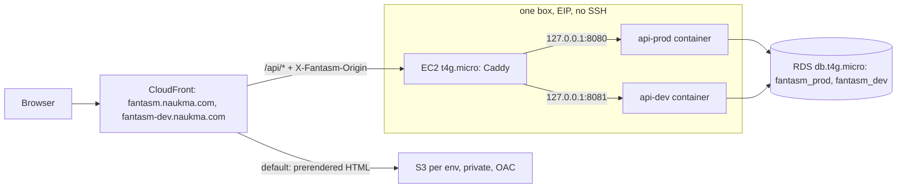

# Інфраструктура Fantasm

Два незалежні Terraform-стеки в одному AWS-акаунті (профіль `personal`, `eu-central-1`, зона `naukma.com`). Два середовища: `prod` і `dev`.

| Стек | Каталог | Стейт (`naukma-coffee-terraform-state-v2`) | Що в ньому |
|---|---|---|---|
| edge | [`edge/`](edge) | `fantasm/frontend/terraform.tfstate` | S3 + CloudFront + ACM + DNS для обох середовищ, OIDC-ролі деплою, секрет origin, опційний WAF |
| backend | [`backend/`](backend) | `fantasm/backend/terraform.tfstate` | EC2 (Caddy + Go), RDS, ECR, SSM, моніторинг |

Порядок **apply: спочатку edge, потім backend**. Backend читає ролі `fantasm-deploy-{dev,prod}` та OIDC-провайдер, створені в edge, а EC2 читає в SSM секрет `/fantasm/<env>/edge/origin-secret`, який теж пише edge. Зворотної залежності немає: CloudFront знає лише ім'я origin-хоста (`fantasm-origin[-dev].naukma.com`), не його стейт.

## Схема



Фронтенд і API стоять за одним хостом (same-origin), тому `__Host-` cookie сесії та OIDC callback `/api/auth/{google|entra}/callback` працюють без CORS.

## Захист бекенду

Три шари, кожен рятує наступний:

1. **Edge.** Порт 443 на EC2 відкритий лише для префікс-ліста CloudFront (`com.amazonaws.global.cloudfront.origin-facing`). Цей список спільний для всіх клієнтів CloudFront, тому Caddy ще й вимагає заголовок `X-Fantasm-Origin` з секретом, який CloudFront додає до кожного `/api/*`. Без нього — 403. SSH немає зовсім: доступ через SSM Session Manager. IMDSv2 з hop limit 1 (контейнери не бачать ключів інстанса).
2. **Caddy** ([`backend/host/Caddyfile.tpl`](backend/host/Caddyfile.tpl)). Адреса клієнта береться з `X-Forwarded-For` лише від CloudFront (`trusted_proxies cloudfront` + strict), далі `rate_limit`: глобальна стеля на секунду для середовища, ліміт на IP за хвилину, окремий жорсткіший ліміт на `/api/auth/{provider}/login` і `/callback`. Тіло запиту до 1 MB, таймаути до Go. Caddy перезаписує `X-Forwarded-For` перевіреною адресою, тож Go бачить одне непідробне значення.
3. **Go.** Власні ліміти, таймаути, пул з'єднань `DB_MAX_CONNS` (prod 8, dev 4; RDS micro дає ~85 з'єднань), заголовки безпеки. Контейнери: `--read-only`, `--cap-drop ALL`, `no-new-privileges`, пам'ять 256 MB, слухають лише `127.0.0.1`.

Ліміти за замовчуванням у [`backend/variables.tf`](backend/variables.tf): `rate_limit_ip_per_min = 600` (університетський NAT ділить одну адресу між багатьма студентами, тому щедро), `rate_limit_auth_per_min = 20`, `rate_limit_global_per_sec` prod 300 / dev 50. Якщо під атакою цього мало, `enable_waf = true` в edge підключає WAFv2 (rate-based правило + AWS Common Rule Set, ~7 USD/міс).

Окремо: SG-правило з префікс-лістом CloudFront рахується як ~55 правил з квоти 60 на SG. Тому SG `fantasm-backend` призначений лише для цього.

## База даних

Один RDS `fantasm-db` (Postgres 17, `db.t4g.micro`, gp3 20 GB, шифрований, бекап 7 днів, `deletion_protection`). Усередині дві бази, `fantasm_prod` і `fantasm_dev`, з окремими ролями-власниками. `CONNECT` відкликано з `PUBLIC`, тож dev-роль не відкриє prod-базу. Базу і ролі створює `init-db` на боксі (ідемпотентно, перед кожним деплоєм). З'єднання з `sslmode=verify-full` і CA-бандлом RDS.

DynamoDB свідомо не використано: домен реляційний (голоси, коментарі, модерація, `hot_score`), міграції на golang-migrate.

## Застосувати

```bash
# 1) edge
cd infra/terraform/edge
terraform init -reconfigure -backend-config=backend.hcl
terraform plan          # очікувано: 0 destroy; prod лише змінюється (moved-блоки)
terraform apply

# 2) створити GitHub environments і змінні (команди в output)
terraform output -raw github_environment_commands
# додай required reviewer для environment prod: Settings -> Environments -> prod

# 3) backend
cd ../backend
terraform init -reconfigure -backend-config=backend.hcl
terraform plan -var alert_email=you@example.com
terraform apply -var alert_email=you@example.com
terraform output -raw github_environment_commands
```

Після першого apply backend: SSM-асоціація сама налаштує бокс (Docker, Caddy, скрипти) через 1–3 хвилини після старту. Перевірка і ручний повторний запуск:

```bash
$(terraform output -raw configure_host_command)
aws ssm list-command-invocations --details --max-items 1   # статус і вивід
```

Якщо edge ще не застосований, конфігурація зупиниться з повідомленням `origin secrets missing in SSM`. Це очікувано.

### OAuth

Клієнти реєструються вручну; redirect URI для кожного середовища:

- `https://fantasm.naukma.com/api/auth/google/callback`, `https://fantasm.naukma.com/api/auth/entra/callback`
- `https://fantasm-dev.naukma.com/api/auth/google/callback`, `https://fantasm-dev.naukma.com/api/auth/entra/callback`

```bash
aws ssm put-parameter --overwrite --type SecureString \
  --name /fantasm/dev/app/google-client-id --value '...'
# те саме для google-client-secret, entra-client-id, entra-client-secret
```

Значення `unset` означає «провайдер вимкнений» (маршрут входу відповідає 404). Нові значення підхопляться при наступному деплої (`refresh-env`).

## Змінні GitHub

Задаються **на рівні environment** (`dev`, `prod`), не репозиторію, щоб prod-джоб ніколи не прочитав dev-значення. Команди друкують обидва стеки: edge дає `VITE_SITE_URL`, `AWS_DEPLOY_ROLE_ARN`, `AWS_FRONTEND_BUCKET`, `AWS_CLOUDFRONT_DISTRIBUTION_ID`; backend дає `ECR_REPOSITORY`, `EC2_INSTANCE_ID`, `SSM_DEPLOY_DOCUMENT`. Старі змінні репозиторію (без environment) лишаються для робочого `ci.yml` до першого деплою з новими ролями; після нього їх і роль `fantasm-frontend-deploy` у `edge/iam.tf` можна видалити.

## Деплой

| Подія | Що відбувається |
|---|---|
| merge у `main` (frontend) | `ci.yml`: чеки, потім збірка з dev-URL, S3 dev, інвалідація dev |
| merge у `main` (backend) | `backend.yml`: тести, збірка arm64 без QEMU, пуш `fantasm-api:sha-<commit>` (immutable), деплой у dev через SSM, smoke через CloudFront |
| prod | вручну `promote-prod.yml` (`workflow_dispatch`, environment `prod` з рев'юером): беремо вже перевірений на dev тег, ставимо alias `release-<sha>`, деплоїмо, smoke, опційно публікуємо фронтенд |

Роль кожного середовища може запускати лише власний SSM-документ `fantasm-deploy-api-<env>`, а не довільні команди (dev-роль не може виконати код на боксі, де живе prod). Тег перевіряє SSM (`^(sha|release)-[0-9a-f]{7,40}$`).

### Відкат

`deploy-api` на боксі сам повертає попередній образ, якщо новий не став `healthy` за 30 с, і завершується кодом 1. Ручний відкат на відомий тег: запустити `promote-prod.yml` зі старим `image_tag` (ECR зберігає останні 40 образів; `release-*` аліаси позначають промотовані).

### Логи і доступ

- Логи API: CloudWatch `/fantasm/<env>/api` (14 днів).
- Шелл на боксі: `aws ssm start-session --target $(terraform output -raw instance_id)`. SSH немає.
- Алерти (SNS на `alert_email`, підтвердь підписку з пошти): статус EC2, CPU credits, вільне місце/памʼять/з'єднання RDS, бюджет по тегу `Project` (треба активувати cost allocation tag у Billing).

## Обмеження, про які варто памʼятати

- API-відповіді 404 отримують HTML-тіло сторінки 404 (статус лишається 404): кастомні відповіді CloudFront діють на весь дистрибутив. Клієнт API орієнтується на статус, не на тіло 404. 403 свідомо не переписується.
- Один бокс обслуговує dev і prod. Dev-деплой не торкається prod-контейнера, але падіння хоста вимикає обидва. Апгрейд до `t4g.small`: `instance_type` у backend (заміна in-place зупиняє інстанс на кілька хвилин).
- Стек backend живе в спільній VPC `naukma-coffee-*` (підмережі та SG-якір `naukma-coffee-rds-sg`). Знесення random-coffee-стека зачепить і його.
- Cutover на `ideas.naukma.com`: змінити `hostnames["prod"]` в `edge`, `public_hostnames["prod"]` в `backend`, перезібрати фронтенд з `VITE_SITE_URL=https://ideas.naukma.com`, зареєструвати нові redirect URI, 301 зі старого хоста. Legacy-стек `naukma-ideas` знищується окремо після `pg_dump` його бази.
